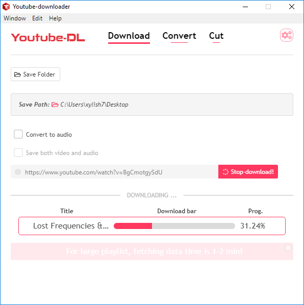
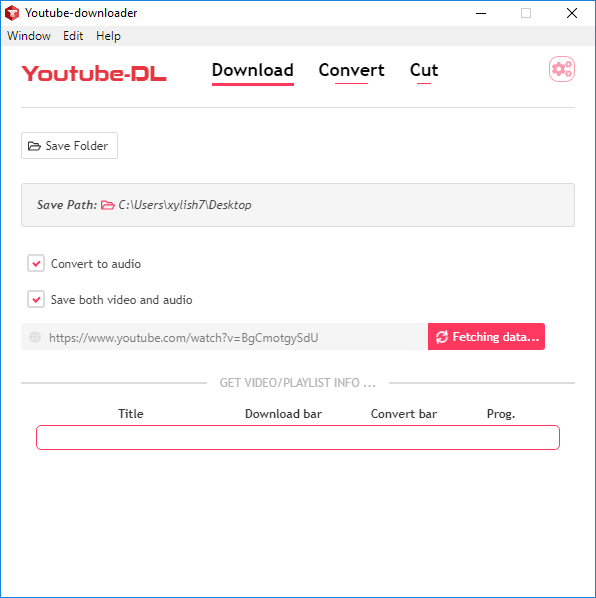
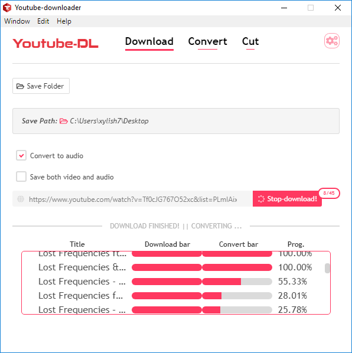
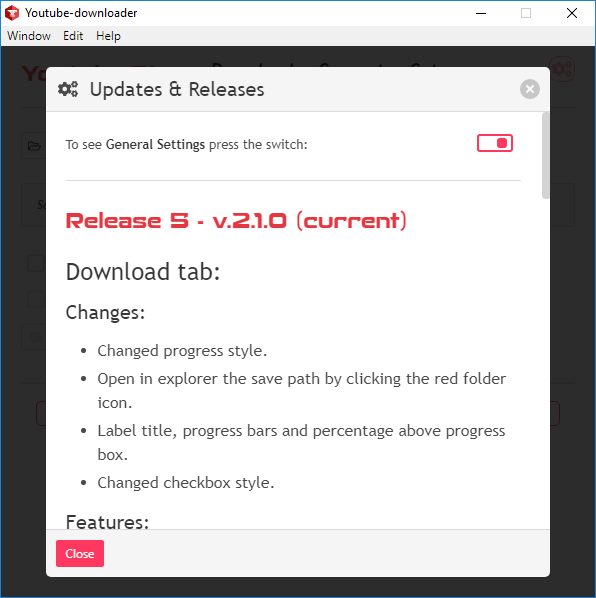

   

<h1 align="center">
  Youtube-Downloader-GUI  
</h1>

❗ This repository is no longer mantained. Check [Youtube-SK](https://github.com/xylish7/Youtube-SK) which is work in progress. ❗

A GUI for [youtube-dl](https://github.com/rg3/youtube-dl). Download and convert youtube videos/playlists to different formats and different qualities.

       

## How to use it?

1. Click on this link: [YT-Downloader-v2.1.3](https://github.com/xylish7/Youtube-Downloader-GUI/releases/download/v2.1.3/yt-downloader-setup-2.1.3.exe). If the link is broken, go to **releases** page and download the last version.
2. Install it on your computer like you do with any other software.
3. Enjoy using it!

## Troubleshooting
1. If the application throws an error when you try to download a video, download the exe file from [here](https://youtube-dl.org/downloads/latest/youtube-dl.exe) and copy the exe file in C:\Program Files\yt-downlaoder\resources\app.asar.unpacked\node_modules\youtuve-dl\bin. For OSes other than Windows find the path to the bin folder and paste that exe in it. 
2. If it still doesn't work, install [Microsoft Visual C++ 2010 Redistributable Package (x86)](https://www.microsoft.com/en-US/download/details.aspx?id=5555).
